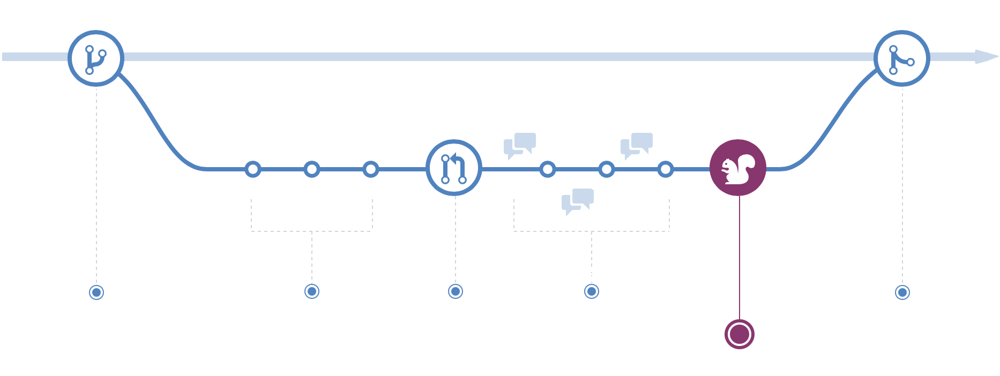

# Working with Pull Requests (GitHub Flow - Modified)

Table of contents

- [Usefull info](https://github.com/NiklasPeterson/GitHubFlow#useful-info)  
  - [List of locked branches](https://github.com/NiklasPeterson/GitHubFlow#list-of-locked-branches)  
  - [List of prefixes for branch names:](https://github.com/NiklasPeterson/GitHubFlow#list-of-prefixes-for-branch-names)  
- [Getting started](https://github.com/NiklasPeterson/GitHubFlow#getting-started)  
- [0. Sprint Start](https://github.com/NiklasPeterson/GitHubFlow#0-sprint-start)  
- [1. Develop phase](https://github.com/NiklasPeterson/GitHubFlow#1-develop-phase)  
  - [1.1 Create feature branch](https://github.com/NiklasPeterson/GitHubFlow#1-1-create-feature-branch)  
  - [1.2 Make changes](https://github.com/NiklasPeterson/GitHubFlow#1-2-make-changes)  
  - [1.3 Open a Pull Request](https://github.com/NiklasPeterson/GitHubFlow#1-3-open-a-pull-request)  
  - [1.4 Review and discuss your code](https://github.com/NiklasPeterson/GitHubFlow#1-4-review-and-discuss-your-code)  
  - [1.5 Test](https://github.com/NiklasPeterson/GitHubFlow#1-5-test)  
  - [1.6 Merge feature_branch into sprint_branch](https://github.com/NiklasPeterson/GitHubFlow#1-6-merge-feature_branch-into-sprint_branch)  
- [2. Staging phase](https://github.com/NiklasPeterson/GitHubFlow#2-staging-phase)  
  - [2.1 Deploy to staging env](https://github.com/NiklasPeterson/GitHubFlow#2-1-deploy-to-staging-env)  
  - [2.2 Make changes](https://github.com/NiklasPeterson/GitHubFlow#2-2-make-changes)  
  - [2.3 Merge to staging](https://github.com/NiklasPeterson/GitHubFlow#2-3-merge-to-staging)  
- [3. Release phase](https://github.com/NiklasPeterson/GitHubFlow#3-release-phase)  
  - [3.1 Deploy to live env](https://github.com/NiklasPeterson/GitHubFlow#deploy-to-live-env)  
  - [3.2 Merge to main/master](https://github.com/NiklasPeterson/GitHubFlow#merge-to-mainmaster)  
- [Hotfix](https://github.com/NiklasPeterson/GitHubFlow#hotfix)

## Usefull info

### List of locked branches

- master/main (permanent)
- staging (permanent)
- dev/develop (permanent)
- sprint_*

> These branches have lock protection, which means that changes/merges can only be committed with PR (Pull requests) and not made directly on the locked branch.

### List of prefixes for branch names:

- sprint_x = larger branch, suited to only exist while the sprint is active. (merges with PR into `staging`, `develop` & `main/master`when done)
- feature_x = smaller to medium branches for working in (merges with PR into sprint_x when done)
- update_x = this is for branches that only contains updates of dependencies
- hotfix_x = urgent fix that needs to go live ASAP (See how to work with hotfixes under the Hotfix Section)

> Branching is a core concept in Git, and the entire GitHub flow is based upon it. There's only one rule: anything in the `main` branch is always deployable.
>
> Because of this, it's extremely important that your new branch is created off of main when working on a feature or a fix. Your branch name should be descriptive (e.g. `feature_formblock`, `hotfix_form-validation`) so that others can see what is being worked on.

------

## Getting started

The *master/main* branch is the “default” branch when you create a repository. We use other branches for development and merge them back (with PR) to the master/main branch after the testing phase is done both in staging and live.

------

## 0. Sprint Start

Once the sprint is defined and is about to start. Create a new branch form `main/master` for the sprint and name it`sprint_<sprint-name>`

------

## 1. Develop phase

While the sprint is active we are working in feature branches

### 1.1 Create feature branch

Now we are ready to beging branching out from the `sprint_x` branch by creating feature branches named `feature_<feature-name>` and switch to it using
`git checkout -b feature_<feature-name>`
a branch is _not available to others_ unless you push the branch to your remote repository
`git push origin <branch>`

> **Tip:** Make a separate branch for each set of unrelated changes. This makes it easier for reviewers to give feedback. It also makes it easier for you and future collaborators to understand the changes and to revert or build on them.

------

### 1.2 Make changes

After the new branch is created, it is time to get to work. Make changes by adding, editing, and deleting files. Whenever you reach a small milestone, add the changes to your branch by commit.

Adding commits keeps track of your work. Each commit should have a message explaining what has changed and why. Each commit becomes a part of the history of the branch, and a point you can revert to if you need to.

This process of adding commits keeps track of your progress as you work on a feature branch.

Each commit has an associated commit message, which is a description explaining why a particular change was made. 

> **Note:** By writing clear commit messages, you can make it easier for other people to follow along and provide feedback  

------

### 1.3 Open a Pull Request

Once you feel that your work related to the feature_x branch is done and ready for code review, it's time to create a Pull Request. A Pull Request notifies people you have changes ready for them to consider or review.

Adding Reviewers: The persons who are going to do a code review and test your PR (1-2 that has relevance to the work you have done) Adding Assignees: Yourself and your co-worker (the people who are working on the branch)

By using GitHub's @mention system in your Pull Request message, you can ask for feedback from specific people or teams.

------

### 1.4 Review and discuss your code

Once a Pull Request has been opened, the reviewers may have questions, comments, or suggestions. Perhaps the coding style doesn't match project guidelines, or a bug is found. Here the reviewers can make suggestions in code or leave comments.

> Pull Requests are designed to allow people to work together easily and produce better results together!

If you receive feedback and continue to improve your changes, you can continue to push to your branch in light of discussion and feedback about your commits. If someone comments that you forgot to do something or if there is a bug in the code, you can fix it in your branch and push up the change. GitHub will show your new commits and any additional feedback you may receive in the unified Pull Request view.

> **Tip:** Pull Request comments are written in Markdown, so you can embed images and emoji, use pre-formatted text blocks, and another lightweight formatting.

------

### 1.5 Test

Once your `sprint_x` branch pull request has been reviewed and the branch passes your tests, you can deploy your changes to verify them in production. If your branch causes issues, you can roll it back by deploying the existing main branch into production.

> **If your branch causes issues, you should fix them in your branch before merging with the master/main branch.**  
> With GitHub, you can deploy from a branch for final testing in production before merging to main.

------

### 1.6 Merge feature_branch into sprint_branch

And start over ;)

------

## 2. Staging Phase

### 2.1 Deploy to staging env

When Sprint is done and ready for being tested on staging it's time to create a PR from sprint_x to staging. If all checks are successful we can trigger a deployment from GitHub Actions.

It's now time to test all new features on staging env

### 2.2 Make changes

If we encounter any bugs we can make adjustments and fixes to the sprint_x branch and 

### 2.3 Merge to staging

After bugfixes and additional testing on staging env is done it's time to merge the PR from `sprint_x` into `staging `.

**Important! Don't delete the branch yet!**

------

## 3. Release Phase

### 3.1 Deploy to live env

Once we have tested everything in the staging env we can now create a PR from sprint_x to the main/master branch. if all our tests are successful, you can deploy your changes to verify them in production. If your branch causes issues, you can roll it back by deploying the existing main branch into production.

When the pull request has been reviewed and everything looks good, it is time for the final testing. GitHub allows you to deploy from a branch for final testing in production before merging with the master branch.

If any issues arise, you can undo the changes by deploying the master branch into production again!

> **If your branch causes issues, you should fix them in your branch before merging with the main/master.**  
> With GitHub, you can deploy from a branch for final testing in production before merging to main.

### 3.2 Merge to main/master

Now that your changes have been verified in production, it is time to merge your code into the main/master branch.

Once merged, Pull Requests preserve a record of the historical changes to your code. Because they're searchable, they let anyone go back in time to understand why and how a decision was made.

**ProTip**

> By incorporating certain keywords into the text of your Pull Request, you can associate issues with code. When your Pull Request is merged, the related issues are also closed. For example, entering the phrase Closes #32 would close issue number 32 in the repository. For more information, check out our [help article](https://help.github.com/articles/closing-issues-via-commit-messages).

Now that your changes have been verified in production, it is time to merge your code into the main branch.

Once merged, Pull Requests preserve a record of the historical changes to your code. Because they're searchable, they let anyone go back in time to understand why and how a decision was made.

## Hotfix

- Create a new branch (`hotfix_x`) from `master`.

- Create one PR from `hotfix` to `master` and have someone review it to validate the fix

- Once it's merged into `master`, create another PR from `hotfix` to `develop`

  and see if you run into merge conflicts

  - If that's the case, resolve the merge conflicts so the PR ends up in a state to be merged, and have someone review the PR

- If there are no merge conflicts, then have someone review the PR
